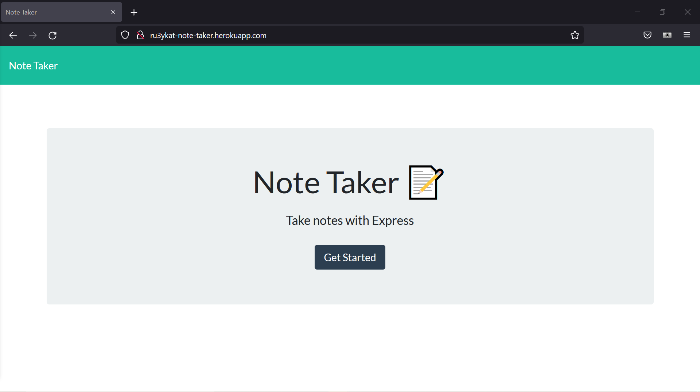
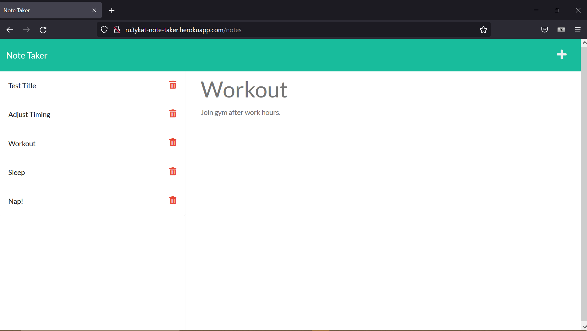
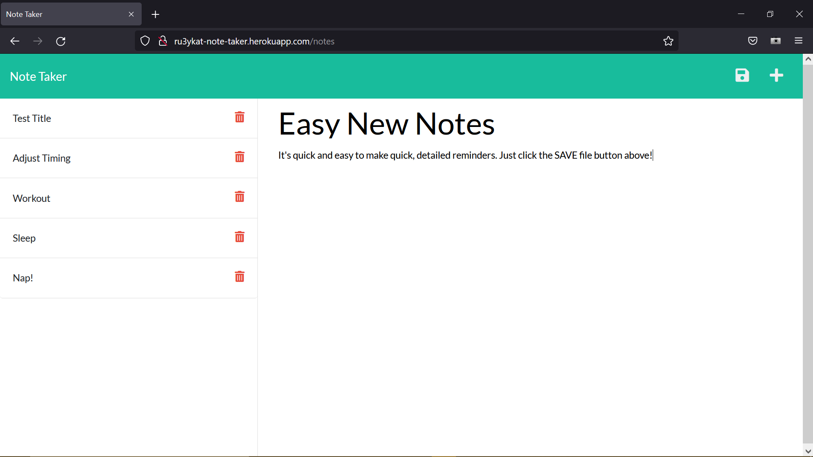

# Note Taker Application

[Note-taker Deploy on Heroku](http://ru3ykat-note-taker.herokuapp.com/)

## Description

An express.js application that allows the quick addition of simple notes with title and text. Data is stored in and retrieved in JSON format.

## Table of Contents

- [Installation Instructions](#installation)
- [Usage Information](#usage)
- [License](#license)
- [Contribution Guidelines](#contributing)
- [Test Instructions](#testing)
- [Questions?](#questions?)

## Installation

To use Note-taker, visit the deployed application at [Note-taker Deploy on Heroku](http://ru3ykat-note-taker.herokuapp.com/).
The repository can also be cloned onto your local machine, and requires [Express.js](https://expressjs.com/) and [uuid](https://www.npmjs.com/package/uuid). Install via command line with:

> npm install express  
> npm install uuid

Run your local Note-taker app by executing npm start from the command line.

All notes can be found in JSON format in db/db.json.

## Usage

  
The Landing page at [Heroku Deployment](http://ru3ykat-note-taker.herokuapp.com/)  

  
Easy note retrieval.

  
Easy note addition.

## License

This project was created using MIT license.

## Contributing

This is an open source project.  

Future deployments to add delete note functionality.

## Testing

To test the program, please follow above Installation guide.

## Questions?

This program was created by [ru3ykat on GitHub](https://github.com/RU3YKat).

Contact me at [ru3ykat on Gmail](ru3ykat@gmail.com).
